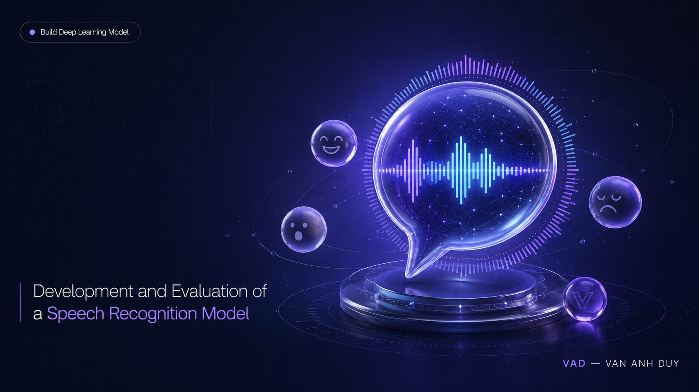

# DPL302m Final Report & Group Presentation (SU25)

## 1. Overview

This project develops a deep learning model for Speech Emotion Recognition using TensorFlow/Keras and audio processing libraries.

## 2. Project Structure

```text
DPL302m_Final_Report&Group_Presentation_SU25/
├── README.md
├── requirements.txt
├── src/
│   └── app.py
├── notebooks/
│   └── training_model.ipynb
├── models/
│   └── MardeusNet.keras
├── reports/
│   ├── final-report.pdf
│   └── group-presentation.pdf
└── dpl-env/
    ├── bin/
    ├── include/
    ├── lib/
    └── pyvenv.cfg
```

## 3. Component Description

- `requirements.txt`: List of required Python packages.
- `src/app.py`: Application entry point for running model inference.
- `notebooks/training_model.ipynb`: Notebook for model training, evaluation, and visualization.
- `models/MardeusNet.keras`: Saved model and trained weights.
- `reports/`: Final report and group presentation slides.
- `dpl-env/`: Local Python virtual environment.

## 4. Environment Setup

```bash
python3 -m venv dpl-env
source dpl-env/bin/activate
pip install -r requirements.txt
```

## 5. Usage

### Run the Application

```bash
streamlit run src/app.py
```

### Open the Training Notebook

```bash
jupyter notebook notebooks/training_model.ipynb
```

## 6. Project Maintenance Notes

- Keep the virtual environment (`dpl-env`) out of version control.
- When working in a team, update `requirements.txt` whenever a dependency is added.
- Avoid modifying the `.keras` model file directly unless necessary.
